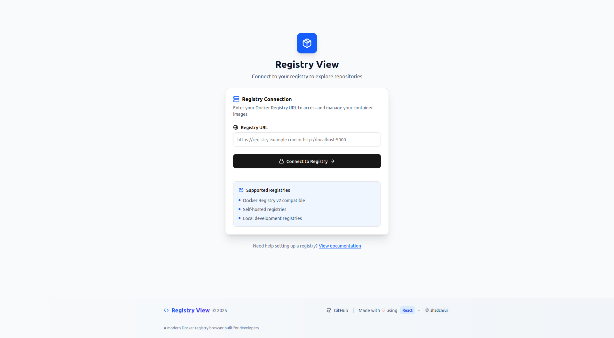
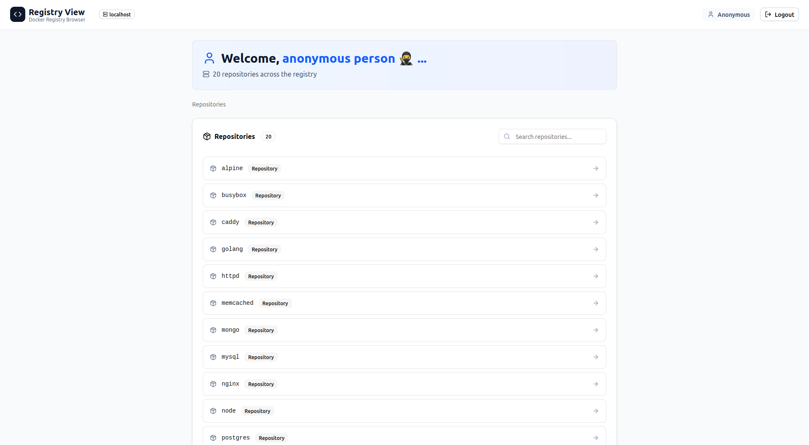
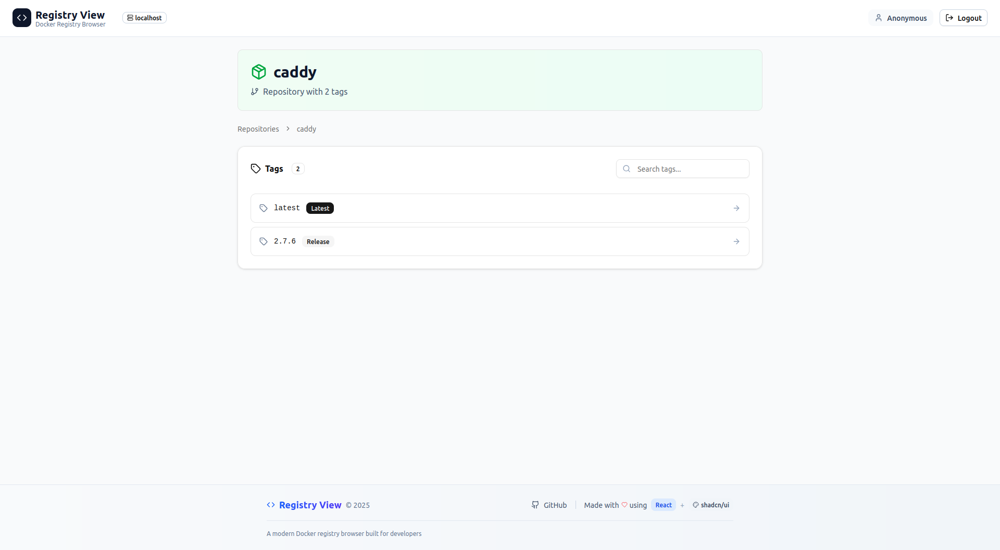
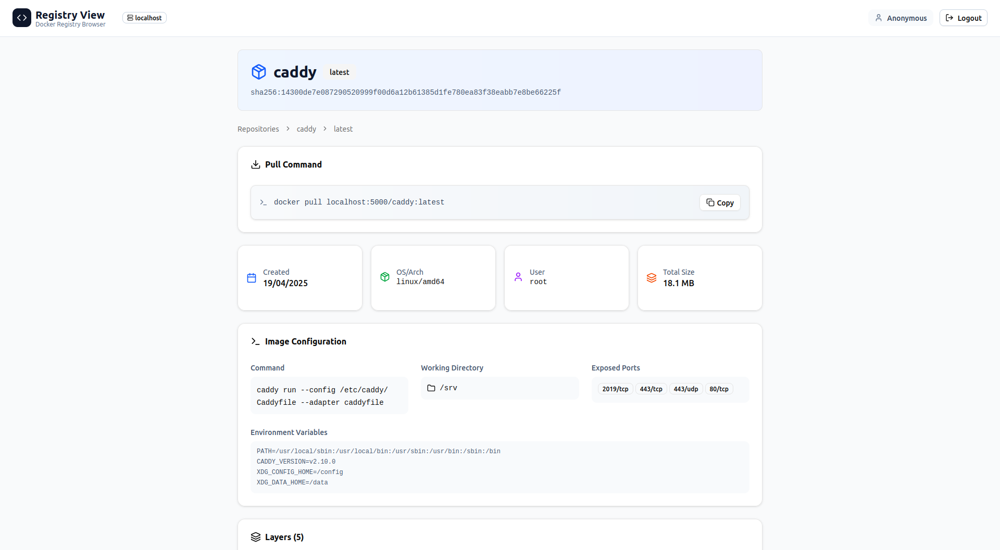

# 🐳 Registry View

[](https://github.com/jwoirhaye/registry-view/actions)
[](https://github.com/jwoirhaye/registry-view/releases)
[](LICENSE)

> **Visualize and explore your Docker v2 registry with ease.** (Just for fun, not really production-ready—use at your own risk :\))

<p>
  
  
  
  
</p>

---

## ✨ Features

- List all your Docker repositories and tags
- Detailed image view (layers, commands, metadata…)
- Modern UI (React + shadcn/ui + TailwindCSS)
- Connect to any Docker v2-compatible registry
- Supports public/private registries (read-only mode, no auth support yet)
- Simple deployment: everything runs in Docker containers

---

## 🚀 Quick Start

### 1. **Clone the repo**


```sh
git clone https://github.com/jwoirhaye/registry-view.git
cd registry-view
```

### 2. **Start everything (frontend, proxy, test registry):**

```sh
docker compose -f deploy/compose/docker-compose.yml up
```

- Frontend available at : [http://localhost:3000](http://localhost:3000)
- Proxy API : [http://localhost:8000](http://localhost:8000)
- Docker Registry (test) : [http://localhost:5000](http://localhost:5000)

### 3. **Usage**

In the UI, enter the registry URL you want to explore:
- For local demo: `http://<your_machine_ip>:5000` (not localhost)

--- 

## 🐳 Populate Registry with Test Images

To quickly populate your local registry with common Docker images for testing, use the provided script:

```sh
# Make the script executable
chmod +x scripts/populate-registry.sh

# Run the script
./scripts/populate-registry.sh
```

> **Note**: The script is configured to use `localhost:5000` as the registry URL. If your registry runs on a different host/port, edit the `REGISTRY_URL` variable in the script accordingly.

This script will pull and push the following images to your local registry:
- nginx (1.25, latest)
- alpine (3.20, latest)
- busybox (latest)
- caddy (2.7.6, latest)
- redis (7.2, latest)
- node (20, latest)
- python (3.12, latest)

After running the script, you can verify the images were pushed by visiting your registry-view application or using:

```sh
curl http://localhost:5000/v2/_catalog
```

---

## 🛠️ Development

See detailed instructions in [DEVELOPMENT.md](docs/DEVELOPMENT.md).

---
## 🤔 Why a proxy?

Due to browser security restrictions (CORS policy), direct requests to Docker registries are often blocked. A simple workaround is to use a proxy.

Our proxy is built in Python with FastAPI to remain fully dynamic—allowing easy switching between registries without needing to restart or reconfigure the proxy each time.

---

## 🗒️ Future Ideas

- Authentication support: Starting with Basic Auth. (But hey, we need to be careful not to leak those credentials everywhere!)

- Kubernetes Support: Writing deployment manifests for Minikube or Kubernetes. (Because why not over-engineer things a little?)

- And of course, anything else your imagination comes up with!

---

## 🧑‍💻 Author

- Jérémy Woirhaye / [GitHub](https://github.com/jwoirhaye)

---

## Licence

This project is licensed under the [MIT License](LICENSE).

---

**Enjoy!**